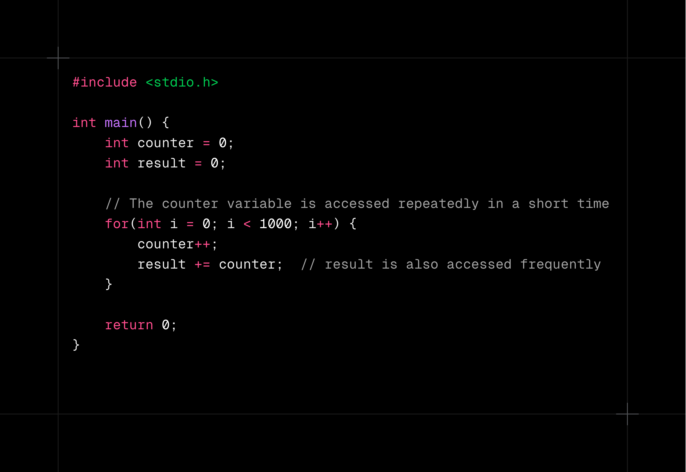
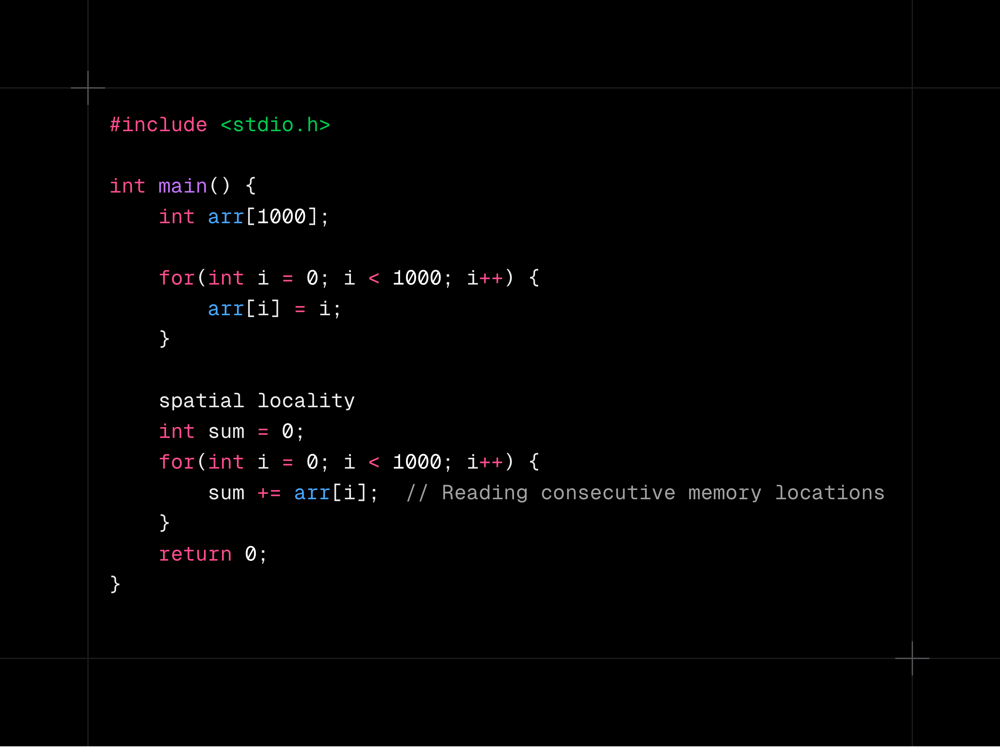
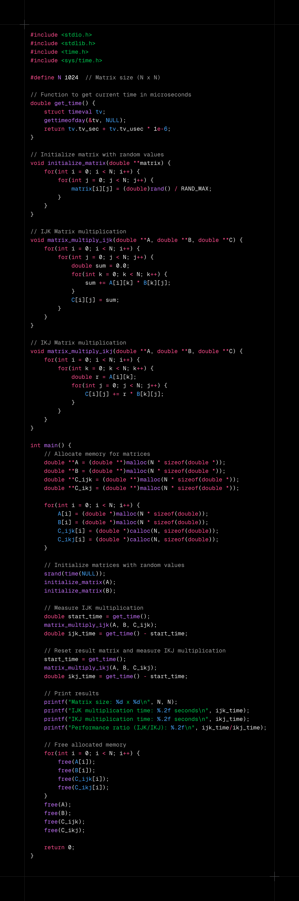
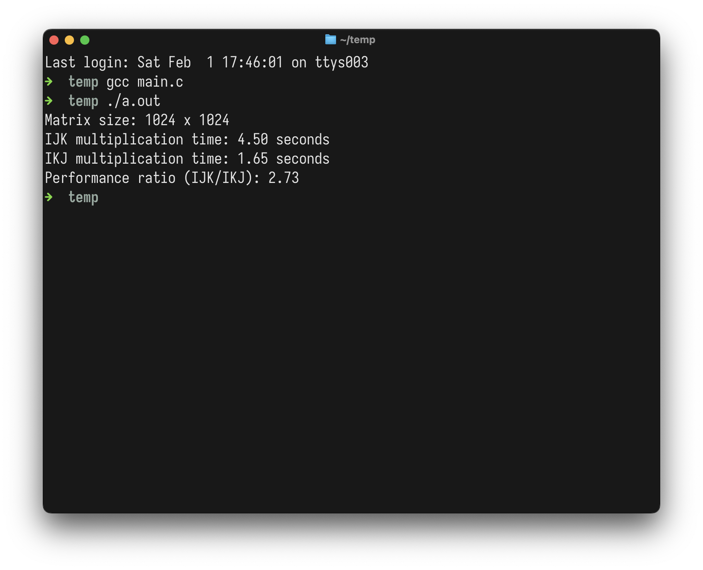

# Introduction

Caches (System Level) are very little space of memories which is slower than registers and faster than RAM and secondary storage.
They are used for retrieving data which is frequently used, to decrease the compute time of a program.

Also, faster the memory, small it is, registers are smallest, there are only few (less than 100) general purpose registers in any Computer Architecture. Caches are in the range of KBs or as large as MBs.

# Levels of Caches

Each processor has their caches. L1 and L2 caches are in every processor.
L3 cache is shared cache, it is shared between all the processors.

Macbook Air M1 has following sizes of Caches

* L1 Cache
    * **Performance Cores**:
        * Instruction cache: 192 KB per core
        * Data cache: 128 KB per core
    * **Efficiency Cores**:
        * Instruction cache: 128 KB per core
        * Data cache: 64 KB per core

 

* L2 Cache

    * **Performance Cores**: 12 MB shared L2 cache (for each group of four performance cores)
    * **Efficiency Cores**: 4 MB shared L2 cache

 

* System Level Cache (SLC)
    * **Base M1**: 8 MB system level cache
 

So, you might be asking, what are these performance and efficiency cores ? so in Apple laptops, they have 2 distinct types of cores,
as self explanatory Performace cores are used for heavy-lifting whereas Efficiency cores are for light-weight tasks.

# Memory Access Patterns

**So, on what basis processor decides what to store in the cache ?**

**Temporal Locality**: If some data is accessed, chances of that to be accessed again is high, so it stores in the cache.

Let's say, if some chef is preparing a multi-course meal, and he chopped some onion for one of the meals, and put it aside, and used it whenever he wanted. Chef avoids walking to the pantry again and again by reusing the same onion.

Example: 

**Spatial Locality**: so it follows the principle of spatial locality, which means, if we are accessing some data, data close to it will be accessed too.

Let's suppose, When you go to supermarket to buy ingredients for Pasta, the store has optimised the layout in such a way that, pasta, tomatoes, cheese are in adjacent aisles, reducing your time there.

Example:

Matrix Multiplication

In above code, I have done matrix multiplication in 2 ways,

* Normal way, IJK,

    * i loop traverses over A matrix's row.
	* j loop traverses over B matrix's column.
	* k loop traverses over both A's row and B's column.

* What was happening was in `sum += A[i][k] * B[k][j];`, `k` is getting changed every iteration in inner most loop, which is happening most often, and we are changing row on every iteration, so CPU is not able to comply with spatial locality.

* If CPU thinks that, okay, `B[0][0]` is getting accessed right now, so `B[0][1]` and `B[0][2]` will also get accessed, so i should put them in cache, but it doesn't happen, with our current logic `B[1][0]` will be accessed next.

* Other way, IKJ

	* same way as above,

	* but the change is `k` is not changing often as before.

Below is visualisation of Matrix Multiplication with `IKJ` format.

 <video width="320" height="240" controls>
  <source src="../public/mm.mp4" type="video/mp4">
  Your browser does not support the video tag.
</video>

Result of above code is:

Also, there are two types of caches (based on what kind of stuff we are storing in the cache):

* I-cache: Instruction cache

	* Suppose we are calling some function again and again, so that functions' instructions get stored into cache.

* D-Cache: Data cache

	* As we did in the above example for Matrix Multiplication, we were storing data of array in cache.

Let's keep it till here in 1st part, this is just introduction, there is more to it. Like, what happens when the data we want is not in cache, what happens when cache is full and much more.

In next part, we will see how cache is managed, how it is filled, how it is flushed, how it is invalidated, and much more.
